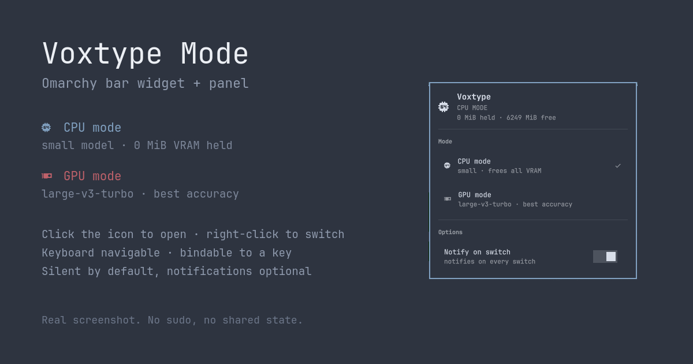

# Voxtype Mode — Omarchy bar widget

Shows whether the [voxtype](https://voxtype.io) dictation daemon is running on **CPU** or
**GPU**, switches between them, and names the model each mode loads.



| State | Icon | Meaning |
|---|---|---|
| CPU mode | 󰻠 | Small model on the CPU. Zero VRAM held — the gaming state. |
| GPU mode | 󰢮 (highlighted) | Large model on the GPU. Best accuracy, ~1.5 GB VRAM resident. |
| Switching | 󰔟 (dimmed) | Daemon restarting and loading the new model. |

**Left click** opens the panel · **right click** switches straight away.

## The panel

- **Which mode is active**, the model it loaded, and how much VRAM is held versus free.
- **Both modes side by side**, each labelled with the model it *would* load — so you can
  see that GPU means `large-v3-turbo` before committing to the switch. Click either to go
  there directly, rather than toggling and hoping.
- **Notify on switch** — off by default. The bar icon already reports the switch, so a
  notification on top of it is redundant; turn it on for when the bar is not where you are
  looking.

Keyboard navigable: arrows or `j`/`k` move, `enter` activates, `esc` closes.

## Why

The voxtype daemon loads its Whisper model at startup and keeps it resident for as long as
it runs — there is no idle-unload setting. On an 8 GB card, `large-v3-turbo` is ~19% of
your VRAM gone before a game even starts. Stopping the service frees it but costs you
dictation entirely.

This widget is the one-click front end for switching between the two, without giving up
dictation in either state.

## Requirements

**This widget is a front end. It does nothing on its own** — it needs the `voxtype-mode`
CLI on your `PATH`:

| Dependency | Why | License |
|---|---|---|
| [`voxtype-mode`](https://github.com/Chernicharo/voxtype-mode), recent enough to support `status --json` | Provides `voxtype-mode status --json`, `toggle`, `cpu` and `gpu` — the only commands this widget ever runs | MIT |
| [voxtype](https://voxtype.io) | The dictation daemon being switched | see upstream |
| Omarchy Quattro (4.x) | The Quickshell bar host that loads the plugin | — |

`nvidia-smi` is optional; without it the VRAM lines are simply omitted.

Install the CLI first:

```bash
git clone https://github.com/Chernicharo/voxtype-mode ~/personal/voxtype-mode
cd ~/personal/voxtype-mode && ./install.sh
```

Verify it before installing the widget — if this prints JSON with a `models` object, the
widget will work:

```bash
voxtype-mode status --json
```

## Install

```bash
omarchy plugin add https://github.com/Chernicharo/omarchy-plugin-voxtype-mode --enable
omarchy restart shell
```

Pick a bar section when prompted, or place it afterwards:

```bash
omarchy bar move io.github.chernicharo.voxtype-mode --section right
```

> **`omarchy restart shell` is not optional.** The hot reload that follows `plugin add`
> renders the icon but does not register the plugin's IPC target, so the keybinding and
> `omarchy-shell` calls below stay dead until the shell has been started once with the
> plugin present. The same applies after editing the QML.

## Remove

```bash
omarchy plugin disable io.github.chernicharo.voxtype-mode
omarchy plugin remove io.github.chernicharo.voxtype-mode
```

Removing the widget does not touch the `voxtype-mode` CLI, your voxtype configs, or the
active mode. Uninstall the CLI separately with its own `./uninstall.sh`.

## Keybinding

Two routes, so you can bind the switch, the panel, or both:

| Call | Does |
|---|---|
| `omarchy-shell io.github.chernicharo.voxtype-mode toggleMode` | Switch CPU ⇄ GPU |
| `omarchy-shell io.github.chernicharo.voxtype-mode toggle` | Open/close the panel |
| `omarchy-shell io.github.chernicharo.voxtype-mode setMode gpu` | Go to a specific mode |
| `omarchy-shell io.github.chernicharo.voxtype-mode toggleNotify` | Flip the notification setting |

`toggle` means open/close the popup, matching every other Omarchy panel — the mode switch
is `toggleMode`.

**Suggested keys: `SUPER + CTRL + SHIFT + X` to switch, `SUPER + CTRL + ALT + X` for the
panel.** Omarchy already keeps voxtype on `X` (`SUPER + CTRL + X` toggles dictation, `F9`
is push-to-talk), so these read as "toggle *how* dictation runs" on the same key. Neither
combo is claimed by stock Omarchy.

In `~/.config/hypr/bindings.lua`:

```lua
o.bind("SUPER + CTRL + SHIFT + X", "Toggle voxtype CPU/GPU mode",
  [[bash -c 'omarchy-shell io.github.chernicharo.voxtype-mode toggleMode 2>/dev/null || notify-send -a voxtype "voxtype" "$(voxtype-mode toggle 2>&1)"']])

o.bind("SUPER + CTRL + ALT + X", "Voxtype mode panel",
  [[omarchy-shell io.github.chernicharo.voxtype-mode toggle]])
```

The `||` fallback covers the window described above, and any session where the shell is not
running: it calls the CLI directly and notifies, since there is no widget to report
anything.

Widget, keybinding and terminal all end up in the same CLI, so they cannot disagree about
the current mode.

## Behaviour notes

- **The widget is a reader, not the source of truth.** The mode is also switchable from a
  keybinding and from the terminal, so it polls `voxtype-mode status --json` every 30
  seconds and refreshes immediately after any switch it starts.
- **It hides itself when the CLI is missing** rather than showing a broken icon, and
  collapses to zero width so it leaves no gap in the bar.
- **Switching is not instant.** The daemon restarts and waits for the model to load; the
  icon dims to 󰔟 for the duration and further switches are ignored until it completes —
  deliberately, so a double press cannot queue two switches that cancel out.
- **No sudo, no system files, no shared state.** Everything runs through the systemd *user*
  service, and the active mode lives in `$XDG_RUNTIME_DIR` (per-user, wiped on logout) —
  not in `/tmp`.
- **Settings persist** to `~/.config/omarchy/shell.json`, under this widget's bar entry.

## License

MIT — see [LICENSE](LICENSE).

Not affiliated with, sponsored by, or endorsed by Omarchy, 37signals, or voxtype.
